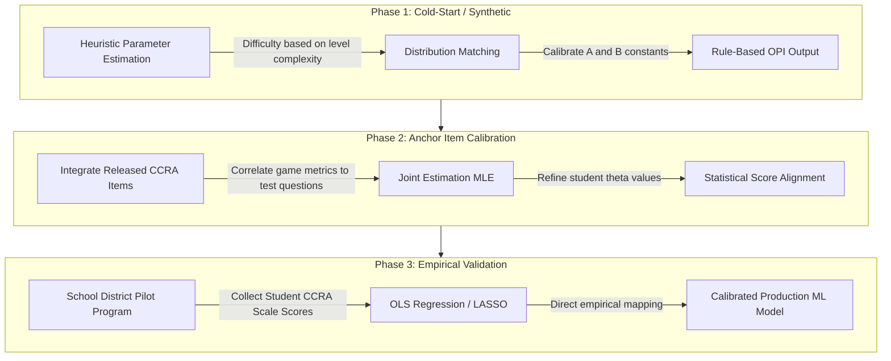

# Methodology: CCRA Alignment & Score Calibration

This document outlines the data science strategy for aligning gameplay telemetry with the Oklahoma Performance Index (OPI) scaled scores (200–399) used on the 11th Grade CCRA Science assessment.

---

## 1. The Psychometric Reality: IRT Pattern Scoring
Oklahoma's CCRA and OSTP assessments do not use simple raw-to-scale mapping (e.g., "answering 30/45 questions equals a score of 300"). Instead, they utilize **Item Response Theory (IRT)** pattern scoring.
*   Under IRT, each test question has distinct parameters: **difficulty** ($\beta$), **discrimination** ($\alpha$), and **guessing probability** ($c$).
*   Answering a highly difficult question correctly boosts a student's score more than answering an easy one.
*   To match this, our predictive backend will estimate the student's latent science ability ($\theta$) based on the difficulty of the gameplay challenges they master.

---

## 2. In-Game IRT Framework
We will treat distinct simulation stages or problem-solving challenges in the DNA simulator as "items" in a test.

### Probability Model (2-Parameter Logistic Model)
The probability $P$ of student $j$ solving gameplay challenge $i$ successfully is modeled as:

$$P(X_{ij} = 1 \mid \theta_j) = \frac{1}{1 + e^{-\alpha_i(\theta_j - \beta_i)}}$$

Where:
*   $\theta_j \sim \mathcal{N}(0, 1)$ represents the student's latent science ability.
*   $\beta_i$ is the difficulty of level/challenge $i$ (e.g., long DNA strands, mutations present, or presence of distractor bases).
*   $\alpha_i$ is the discrimination parameter (how well the level separates high-ability students from low-ability students).

### From Telemetry to IRT Responses (Polytomous Scoring)
Instead of a simple binary pass/fail, we will use the **Graded Response Model (GRM)** to map telemetry features into ordinal response categories ($k$):
*   **Category 0 (Below Basic/Basic proxy):** Unable to solve, relies heavily on hints, or demonstrates random guessing behavior (e.g., high action counts with low accuracy).
*   **Category 1 (Proficient proxy):** Solves the level but shows high error correction, slow response time, or minor efficiency gaps.
*   **Category 2 (Advanced proxy):** Solves the level systematically, rapidly, and with zero transcription errors on the first attempt.

---

## 3. Scale Score Mapping & Distribution Alignment

Once we estimate a student's latent ability $\theta_j$ via Maximum Likelihood Estimation (MLE), we must translate it to the OPI scale ($S_j$):

$$S_j = A \cdot \theta_j + B$$

To find the scaling constants $A$ and $B$ without a direct student-by-student state test dataset, we will employ two calibration techniques:

### A. Distribution Matching (Equipercentile Equating)
Using historical, publicly available OSDE school report card datasets, we can identify state-wide science proficiency distributions. For example:
*   If the state-wide data shows that **55%** of students score at or above **Proficient (300)**:
*   Under a standard normal distribution $\theta \sim \mathcal{N}(0, 1)$, the 45th percentile corresponds to a $\theta$ of approximately $-0.13$.
*   Therefore, $\theta = -0.13$ must map to $S_j = 300$.
*   If the top **15%** score **Advanced (327+)**, the 85th percentile corresponds to $\theta = 1.04$, mapping to $S_j = 327$.
*   Solving the system of linear equations yields our initial scaling factors:
    $$A \approx 23.08, \quad B \approx 303.00$$

### B. Anchor Checkpoints (Released Items)
We will embed 3–5 officially released CCRA Science assessment questions as diagnostic "mini-challenges" in the app. 
*   Because these items are public domain and have historical state-wide difficulty/p-values, they act as **anchor items**.
*   We can calibrate the gameplay difficulty parameters ($\beta_i$) relative to these anchor items, grounding our latent scale ($\theta$) directly in the state test's scale.

---

## 4. Calibration & Model Progression Roadmap

---

## 5. Ongoing Research & Public References
To continually refine this alignment, we will leverage:
1.  **OSDE Testing Technical Manuals:** Published annually by the Oklahoma State Department of Education (OSDE). These reports contain the technical equating summaries, standard deviations, and population curves for the CCR science assessment.
2.  **Cognia OSTP Technical Bulletins:** Detail the specific psychometric models (typically 1PL/3PL IRT models) used in the assessment design.
3.  **NAEP / TIMSS Science Datasets:** Large-scale public datasets that capture both process telemetry (e.g. time-on-task, tool use in digital science simulations) and final assessment outcomes. We can use these to pre-train sequence models on student problem-solving patterns.

---

## 6. FERPA & Data Privacy Guidelines for Model Training
To retrain and validate our predictive models using end-of-year (EOY) state assessment data, we must adhere strictly to the **Family Educational Rights and Privacy Act (FERPA)**. 

Because we do *not* need Personally Identifiable Information (PII) to train a machine learning model, we will implement a **Zero-PII De-identification Pipeline**:

### A. De-identification at the Source
*   Before exporting student gameplay telemetry and matching EOY CCRA scores to our modeling pipeline, all PII (names, email addresses, student IDs, teacher names, school names) must be stripped.
*   Students will be represented in the dataset *only* by a cryptographically secure, randomized hash (e.g., UUIDv4) that cannot be reverse-engineered to identify the student.

### B. Secure Score Ingestion (Matching Pipeline)
*   When a school administrator uploads the EOY assessment file (usually a CSV from the testing portal), the backend will perform the join in memory.
*   **The Join Process:**
    1. The admin uploads a CSV mapping local student IDs to CCRA scaled scores.
    2. The production database joins this file against the encrypted `student_ids` to fetch the corresponding randomized UUIDs.
    3. The pipeline writes the dataset `[random_uuid, telemetry_features, scaled_score]` to the training store.
    4. The uploaded CSV and raw identifiers are immediately purged from memory and never written to disk or logs.

### C. Data Minimization & Demographics
*   Only the minimum necessary data points will be extracted for training: `[De-identified UUID, Telemetry Feature Vector, EOY Scaled Score]`.
*   School district, campus, and classroom labels will be converted to categorical proxy variables (e.g., `district_density_class`, `class_size`) to prevent indirect re-identification through demographic deduction.

