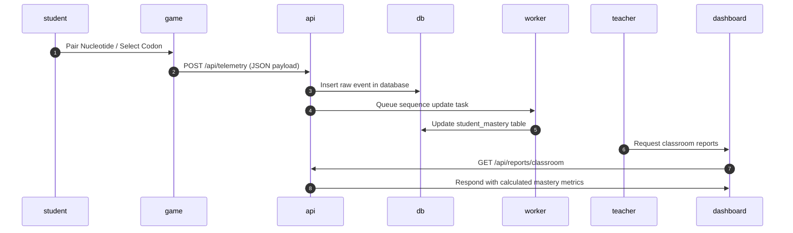

# Product Design Document: Swift Science (Assessment Game & Analytics)

This document defines our product scope, component architecture, and active tasks for Swift Science. Use the **Backlog** section to capture new ideas so we can evaluate them later and prevent feature creep.

---

## 1. Product Scope & Boundaries

### In-Scope (MVP)
*   **Single Gameplay Module**: A simple 2D DNA Transcription & Translation simulation matching DNA bases to mRNA and translating codons into amino acids.
*   **Standard Telemetry Hook**: Logging of start, stop, base pair matching attempt, error correction, and translation completion events.
*   **Simplified BKT Model**: A rule-based or basic statistical heuristic mimicking Bayesian Knowledge Tracing to estimate student proficiency.
*   **Dual Dashboards**:
    *   **Teacher**: Roster list, student progress, standard mastery indicator.
    *   **Parent**: General feedback and recommended home activity.
*   **Basic Authentication**: Student, Teacher, and Parent accounts.

### Out-of-Scope (Deferred to Backlog)
*   3D graphics or physics-heavy game engines.
*   Full Integration with Clever / Google Classroom.
*   District-level enterprise reporting dashboards.
*   Automatic Stripe recurring subscriptions and seat purchasing flows (mocked or deferred).
*   Multiplayer elements, classroom leaderboards, or student avatars.

---

## 2. Architecture & Data Flow

---

## 3. Active Task Board (MVP)

### Track A: Backend & Telemetry
*   [ ] **Task A1**: Initialize Django project and database models (`Student`, `Teacher`, `Classroom`, `TelemetryEvent`, `MasteryState`).
*   [ ] **Task A2**: Build Telemetry API Endpoint (`/api/telemetry/`) with request validation.
*   [ ] **Task A3**: Create mock data scripts (generating telemetry logs for 10 mock students).
*   [ ] **Task A4**: Implement basic Bayesian Knowledge Tracing (BKT) analyzer to compute mastery.

### Track B: Game Development
*   [ ] **Task B1**: Set up Next.js application framework with TailwindCSS.
*   [ ] **Task B2**: Build DNA Simulator board (Canvas/SVG interface with nucleotide base matching).
*   [ ] **Task B3**: Connect simulator actions to backend Telemetry API.

### Track C: Dashboards & UX
*   [ ] **Task C1**: Implement User Authentication (Student, Teacher, Parent roles).
*   [ ] **Task C2**: Build Teacher Dashboard UI (roster, mastery table with predicted CCRA bands, and accountability flagging for students below the 300 Proficient threshold).
*   [ ] **Task C3**: Build Parent Dashboard UI (simple progress charts, activity cards).

---

## 4. Product Backlog (Future Features)

*To prevent scope creep, all new ideas, suggestions, and complex features go here first for prioritization.*

| Category | Feature Description | Priority | Complexity | Status |
| :--- | :--- | :--- | :--- | :--- |
| **Integrations** | Clever & ClassLink SSO and auto-rostering integration | Medium | High | Backlog |
| **Integrations** | Google Classroom synchronization | Medium | Medium | Backlog |
| **Monetization** | Automated Stripe invoicing for school purchase orders | High | Medium | Backlog |
| **Gamification** | Student Avatar customizer and accessory shop | Low | Medium | Backlog |
| **UX** | Real-time classroom leaderboard (optional opt-in for teachers) | Low | Low | Backlog |
| **Analytics** | Deep Knowledge Tracing (DKT) model using Recurrent Neural Networks | Low | High | Backlog |
| **Content** | Ecosystem Simulator module (B.LS2.1 - carrying capacity simulator) | High | Medium | Backlog |
| **Content** | Physical Sciences module (e.g., Simple Circuits, Force & Motion simulator) | High | Medium | Backlog |
| **Content** | Earth & Space Sciences module (e.g., Water Cycle, Moon Phases) | High | Medium | Backlog |

