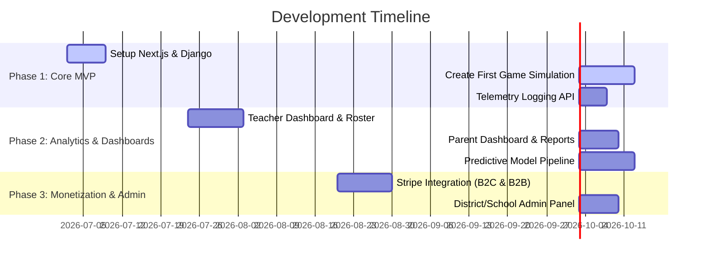

# Project Plan: Swift Science (Assessment Game & Analytics Platform)

This document serves as our shared master plan and reference as we build Swift Science. It outlines the architectural phases, data schema for game telemetry, predictive modeling pipeline, and monetization dashboard milestones.


---

## 1. Architectural Stack

*   **Frontend (App & Dashboards):** Next.js (React) + TailwindCSS.
*   **Frontend (Game Canvas):** React Canvas/SVG for simulation-style puzzles (easier integration with telemetry and Next.js state).
*   **Backend (API & Business Logic):** Django + Django REST Framework (DRF) for student/class/district hierarchies, authentication, and security.
*   **Data Processing & ML:** FastAPI (lightweight Python service) or Celery task worker + `scikit-learn` / `statsmodels` (for modeling / BKT / IRT).
*   **Database:** PostgreSQL (with JSONB for flexible raw telemetry logging).
*   **Billing/Monetization:** Stripe (metered seat licenses for schools, direct SaaS subscriptions for families).

---

## 2. Roadmap Phases



### Phase 1: Core Game & Telemetry MVP
*   **Goal:** Build a playable simulation level (specifically DNA Transcription & Translation) that logs student action telemetry to PostgreSQL, alongside a dev-mode admin panel.
*   **Deliverables:**
    *   Next.js project container + styling system.
    *   Django database models for `Student`, `Session`, and `TelemetryEvent`.
    *   Playable DNA base-pairing simulation emitting telemetry, and a mock District Admin dashboard layout.

### Phase 2: Analytics & Dashboards
*   **Goal:** Surface diagnostic reports to parents, teachers, and district administrators showing predicted science assessment scores and standard mastery based on the 11th Grade CCRA blueprint.
*   **Deliverables:**
    *   Authentication and Role-Based Access Control (RBAC) for Students, Teachers, and District Admins.
    *   Teacher dashboard (rosters, progress tracking, OAS standard gaps, OPI cutoff colors).
    *   Parent dashboard (growth metrics, family tips).
    *   District Admin dashboard (cross-campus OPI average, seat license utilization, and EOY score import interface).
    *   Python background tasks for calculating student state (e.g., Bayesian Knowledge Tracing parameters).

### Phase 3: Admin & Monetization
*   **Goal:** Implement school/campus seat licenses and individual family subscriptions.
*   **Deliverables:**
    *   School/District admin portals (seat quota allocations, teacher invite codes, subscription logs).
    *   Stripe checkout integrations (direct consumer card billing & B2B district invoice generation).
    *   Google Classroom / Clever SSO integration.


---

## 3. Initial Telemetry Schema

We will log telemetry in JSONB to allow flexible schemas as we refine gameplay.

```sql
CREATE TABLE telemetry_events (
    id UUID PRIMARY KEY DEFAULT gen_random_uuid(),
    session_id UUID NOT NULL REFERENCES student_sessions(id),
    student_id UUID NOT NULL REFERENCES students(id),
    timestamp TIMESTAMPTZ DEFAULT now(),
    event_type VARCHAR(50) NOT NULL, -- e.g., 'level_start', 'pair_base', 'select_codon', 'submit'
    level_id VARCHAR(50) NOT NULL,
    construct_tag VARCHAR(100),       -- e.g., 'OAS.B.LS1.1' (DNA determines proteins)
    payload JSONB NOT NULL           -- Detailed action data (nucleotides paired, errors, duration)
);
```

---

## 4. Project Configuration & Parameters

1.  **Target Grade Level / Assessment:** Oklahoma Grade 11 College- and Career-Readiness Assessment (CCRA) Science Test (aligned with 2023-2024 blueprint).
2.  **Active Target Standard (MVP):** **B.LS1.1** (Life Sciences, Domain: Structure and Processes - *DNA structure determines protein structure and function*).
3.  **Predictive Model Baseline:** Assessed against the 11th Grade CCRA Blueprint reporting categories (Physical Sciences and Life Sciences, each weighting 45-55% of the exam).
4.  **CCRA Scaled Score Performance Bands:**
    *   **200 - 277:** Below Basic
    *   **278 - 299:** Basic
    *   **300 - 326:** Proficient *(State Accountability Target)*
    *   **327 - 399:** Advanced
    *   *Modeling Goal:* Since scores are scaled (not raw), our predictive engine will model both the predicted scaled score range and a binary classification: **"On Track for Proficiency" (Score >= 300)** vs. **"Needs Support" (Score < 300)**. Surfacing this binary status is highly actionable for teachers to intervene before state tests.
5.  **Google Cloud Project Configuration:**
    *   **Project ID:** `swift-science-38291`
    *   **Project Name:** Swift Science
    *   **Billing Account:** Linked to `01FC83-1C38A1-D898DA` (My Billing Account)


