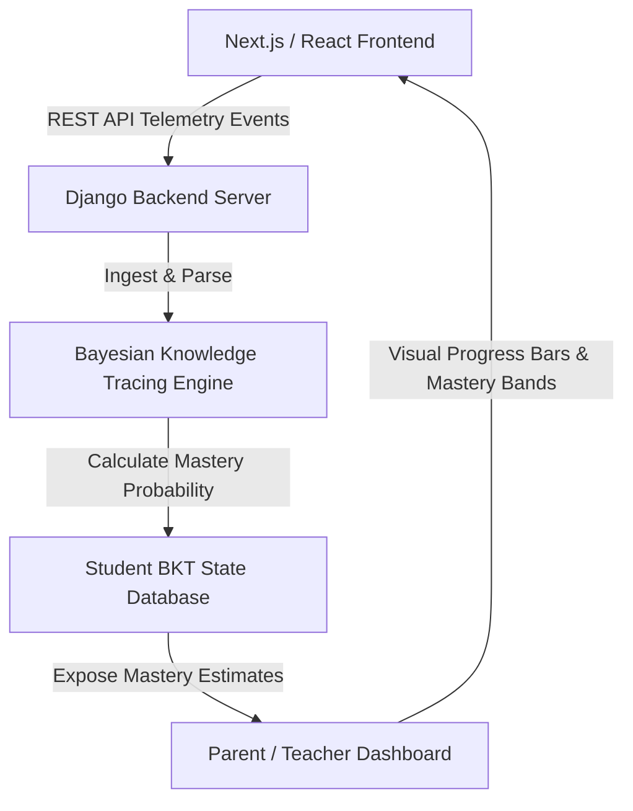

# Swift Science: Adaptive Learning Platform
## Executive Summary & Portfolio Artifact

**Swift Science** is a state-of-the-art, adaptive educational platform designed to deliver standard-aligned secondary school science instruction. The application integrates dynamic simulation environments, interactive Depth of Knowledge (DOK) workspaces, and a real-time predictive student modeling engine. 

Aligned directly with the **Oklahoma Academic Standards (OAS)** for Biology and Physical Sciences, the platform guides students through rigorous learning pathways. It enforces conceptual mastery using a 3-question gating quiz system before unlocking advanced interactive simulators.

---

## 🏗️ System Architecture & Core Features

### 1. Bayesian Knowledge Tracing (BKT) Engine
* **Dynamic Student Modeling**: Utilizes four distinct parameters per standard (*Prior Mastery*, *Learn Rate*, *Guess Probability*, and *Slip Probability*) to estimate the probability that a student has mastered a concept.
* **Real-time Updates**: Updates student states instantly upon the completion of standard-aligned checks and interactive exercises.
* **Dashboard Visualization**: Translates raw BKT mastery metrics into user-friendly progress bars and color-coded mastery bands (e.g., Novice, Competent, Master) on the Parent and Teacher Dashboards.

### 2. Standard-Aligned Curriculum Workspaces
* **Curriculum Gating Checklist**: Implements 3-question randomized quizzes (drawn from a pool of 10 competency questions) for all DOK levels. Successfully passing the checklist gates and unlocks the corresponding simulation workspace.
* **Biology (OAS.B.LS1.1 - LS4.5)**: Includes DNA base-pairing, codon lookup wheels, tissue matrix matching, cardiopulmonary simulators, kidney synthesis workbenches, Punnett squares, pedigrees, natural selection cladograms, and global carbon cycling modelers.
* **Physical Science (OAS.B.PS1.1 & OAS.PS.PS1.2 - PS4.4)**: Includes molecular bonding simulators, reaction rate factors, conservation of mass balance, electromagnetic induction, wave kinematics, and radiation absorption.
* **Responsive Interactive Periodic Table**: Displays a custom 118-element reference visualization (s, p, d, and f-blocks) dynamically during physical science tasks to assist student problem-solving.

---

## 🛠️ Technical Skill Profile

### Frontend Engineering & Visual Design
* **Technologies**: Next.js 16+, React, Vanilla CSS, TailwindCSS.
* **Key Skills**:
  * Developing dense, interactive graphical interfaces (sliders, drag-and-drop matrices, dropdown matching, and custom charting tools).
  * Implementing premium UI/UX aesthetics (dark mode, glassmorphism, custom-tailored HSL color palettes, responsive layout grids, and smooth micro-animations).
  * Building fluid 4-column responsive grid systems supporting high-density telemetry alongside the main workspace.

### Backend Engineering & Math Modeling
* **Technologies**: Python, Django REST Framework, SQLite/PostgreSQL.
* **Key Skills**:
  * Developing structured REST APIs to capture telemetry events.
  * Writing custom Django management commands and CLI scripts to verify data consistency and seed BKT metrics.
  * Designing database schema migrations to extend student progress logging with custom BKT parameter tracking.
  * Writing robust Django test suites ensuring backend stability.

---

## 🤖 Advanced Agentic AI Co-Authoring & Collaboration

A defining characteristic of this project was its development using **Agentic AI pair-programming methodologies**. The engineering workflow showcased a state-of-the-art division of labor between human direction and agentic execution:

### 1. Specification & Template Enforcement
* **Human Action**: Authored strict guidelines, such as [activity_standard_design.md](file:///c:/Users/swift/edapp/planning/activity_standard_design.md), to define the standard activity templates, telemetry events (`dok[X]_activity_check`, `dok[X]_activity_complete`), and gating behaviors.
* **AI Action**: Ingested the design rules, proactively verified compliance, and automatically injected compliant code across dozens of standards.

### 2. Script-Driven Mass Code Injection
* **Human Action**: Guided the architectural placement of code blocks and corrected parsing errors during large-scale changes.
* **AI Action**: Wrote custom Python injection scripts (like `apply_frontend.py`) utilizing robust AST-like and pattern-matching block replacements. This prevented syntax issues when modifying dense files (like `page.js` exceeding 56,000 lines of code) and maintained 100% compilation safety.

### 3. Autonomous Verification & Visual Regression Testing
* **Human Action**: Specified test requirements, user login details, and expected validation pathways.
* **AI Action**: Spawned autonomous **browser subagents** to navigate the app, log in (handling default text clearing), complete interactive quizzes, trigger workspace unlocks, and record WebP/PNG screen captures for visual verification.

### 4. Checkpointing & State Preservation
* **Collaborative Process**: Leveraged structured checklists ([task.md](file:///c:/Users/swift/.gemini/antigravity-ide/brain/c63a1a09-ce9a-4cbc-9bf7-682096963248/task.md)), implementation plans, and checkpoint walkthroughs to persist system context across development sessions, enabling seamless transitions during complex feature builds.
